# Kafka notes

These are the most relevant contents that I collected through some books and courses. I organized and make some edits to help deliver the concepts about Apache Kafka in the most comprehensible way. Anyone who wants to learn Apache Kafka can reference these notes without going through too many resources on the Internet. Below might be the only material you need to grasp quite a basic understanding of Kafka as well as how to configure your applications to use Kafka properly in production.

If you want to get a deeper understanding of Kafka or how to use Kafka Stream for big data processing. I highly recommend you check out the material including some books and courses that I linked in the reference section.

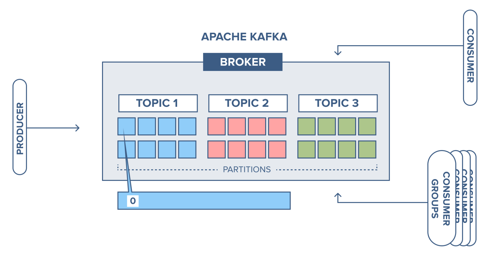
<sup>image from https://www.cloudkarafka.com/blog/<sup>

If you want a better reading exeperience, visit: https://anhthi.netlify.app/docs/architecture/message_queue/kafka

Table of contents:
- [Kafka notes](#kafka-notes)
  - [Kafka introduction](#kafka-introduction)
    - [The data problem](#the-data-problem)
    - [Why use Kafka?](#why-use-kafka)
    - [Why is Kafka fast?](#why-is-kafka-fast)
    - [Compared to other message queue systems](#compared-to-other-message-queue-systems)
    - [Use Cases](#use-cases)
  - [Kafka architecture](#kafka-architecture)
    - [Log](#log)
    - [Topics](#topics)
    - [Partitions](#partitions)
    - [Difference between Partition and Log?](#difference-between-partition-and-log)
      - [Partitions group data by key](#partitions-group-data-by-key)
    - [Important characteristics of Kafka](#important-characteristics-of-kafka)
  - [Producers and Consumers](#producers-and-consumers)
    - [Producer](#producer)
    - [Consumer](#consumer)
      - [Consumer group](#consumer-group)
      - [Flow of sending a message](#flow-of-sending-a-message)
  - [Broker and Clusters](#broker-and-clusters)
    - [Broker](#broker)
    - [Cluster membership management with Zookeeper](#cluster-membership-management-with-zookeeper)
    - [Cluster controller](#cluster-controller)
    - [Replica](#replica)
      - [Leader replica](#leader-replica)
      - [Follower replica](#follower-replica)
  - [Confugrations](#confugrations)
    - [Hardware selection](#hardware-selection)
      - [Disk Throughput](#disk-throughput)
      - [Disk capacity](#disk-capacity)
      - [Memory](#memory)
    - [Partitions count, replication factor](#partitions-count-replication-factor)
      - [Patitions](#patitions)
      - [Replication: should be at least 2, usually 3, maximum 4](#replication-should-be-at-least-2-usually-3-maximum-4)
    - [Configure topic](#configure-topic)
      - [Retention and clean up policies(Compaction)](#retention-and-clean-up-policiescompaction)
      - [Paritions and Segments](#paritions-and-segments)
    - [Configure producer](#configure-producer)
      - [Kafka broker discovery](#kafka-broker-discovery)
      - [Options for producer configuration](#options-for-producer-configuration)
      - [Message compression for high-throughpput producer](#message-compression-for-high-throughpput-producer)
      - [Producer batching](#producer-batching)
      - [Idempotent producer](#idempotent-producer)
    - [Configure consumer](#configure-consumer)
      - [How kafka handle consumers exit/enter groups?](#how-kafka-handle-consumers-exitenter-groups)
      - [Controlling consumer liveness?](#controlling-consumer-liveness)
      - [Consumer offset](#consumer-offset)
      - [Consumer offset reset behaviours](#consumer-offset-reset-behaviours)
      - [Delivery semantics for consumers](#delivery-semantics-for-consumers)
      - [Offset management](#offset-management)
      - [Consumer offset commits strategies](#consumer-offset-commits-strategies)
      - [Schema registry](#schema-registry)
  - [Case study](#case-study)
    - [Video analytics - MovieFlix](#video-analytics---movieflix)
    - [GetTaxi](#gettaxi)
    - [Campaign compare](#campaign-compare)
    - [Mysocial media](#mysocial-media)
    - [Finance application - MyBank](#finance-application---mybank)
    - [Big data ingestion](#big-data-ingestion)
  - [Kafka internal](#kafka-internal)
    - [Request processing](#request-processing)
    - [Physical storage](#physical-storage)
      - [Partition Allocation](#partition-allocation)
      - [File Management](#file-management)
  - [References](#references)

## Kafka introduction

### The data problem
- You need a way to send data to a central storage quickly
- Because machines frequently fail, you also need the ability to have your data replicated, so those inevitable failures don't cause downtime and data loss

That's where Apache Kafka comes in as an effective solution. Apache Kafka is a publish-subscribe based durable messaging system developed by Linkedin.

### Why use Kafka?
- **Multiple producers and consumers at any given time** without interfering with each other.  This is in contrast to many queuing system where one message is consumed by one client
- **Disk-Based retention**: 
  - Consumers do not always need to work in real time. Messages are commited to disk and stay for some periods of time.
  - There is no danger of losing data.
- **Fast**: Kafka is a good solution for applications that require a high throughput, low latency messaging solution. Kafka can write up to 2 million requests per second
- **Scalable**: 
  - Expansions can be performed while the cluster is online, with no impact on the availability of the system as a whole.
- **High Performance**: Excellent performance under high load. 

### Why is Kafka fast?

- **Zero Copy**: Basically Kafka calls the OS kernel directly rather than at the application layer to move data fast.
- **Batch data in chunks**:  Kafka is all about batching the data into chunks. This minimises cross machine latency with all the buffering/copying that accompanies this.
- **Avoids Random Disk Access**: Kafka is designed to access the disk in sequential manner. This enables it to get similar speeds from a physical disk compared with memory.
- **Can scale Horizontally**: The ability to have thousands of partitions for a single topic spread among thousands of machines means Kafka can handle huge loads.


### Compared to other message queue systems

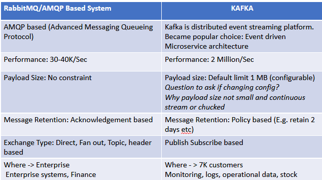

### Use Cases

- **Activity tracking**: The original use case for Kafka, designed at LinkedIn, is that of user activity tracking.

- **Messaging**: when applications need to send notifications to users. Those can produce messages without needing to be concerned about formatting. Then an other applicatoin can read all the messages and handle them consistently.
- **Metrics and logging**
- **Commit log**: Database changes can be published to Kafka and applications can easily monitor this stream to receive live updates as they happen. 
- **Stream processing**: Kafka is extremely good for streaming and processing huge datasets.

## Kafka architecture

Kafka is a message broker. A broker is an intermediary that brings together two parties that don't necessarily know each other for a mutually beneficicial exchange or deal.


### Log
Is a file that Kafka appends incoming records to. A log is an append-only, totally ordered sequence of records ordered by time

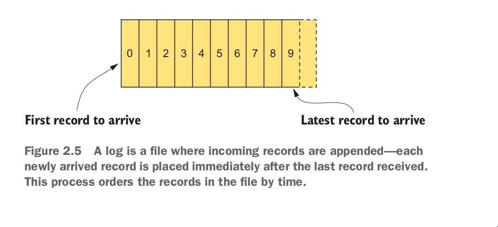

Configuration setting `log.dir`, specifies where `Kafka` stores log data on disk.

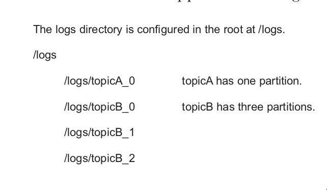

### Topics

Topics are logs that are seperated by topic name. Thinks topics as labeled logs. The closest analogies for a topic are a database table or a folder in a filesystem.

Topic name examples: 
- orders
- customers
- paymments

To help manage the load of messages coming into a topic. Kafka use `partitions`
  
Topics are broken down into a number of `partitions`. 

`Partitions` are the way that Kafka provides redundancy and scalability. Each partition can be hosted on a different server, which means that a single topic can be scaled horizontally across multiple servers.

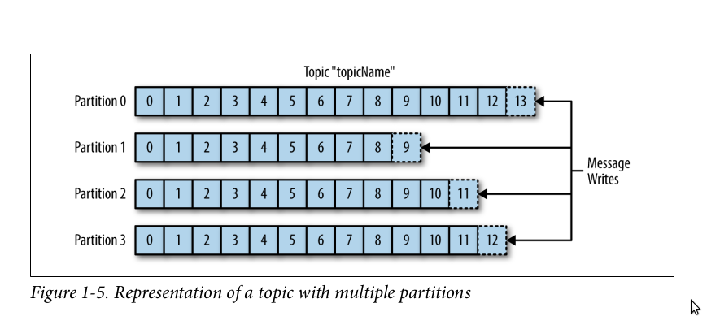

### Partitions
- Help increasing throughput
- Allows topic messages to be spread across several machines so that the capacity of a given topic isn't limited to the availble disk space one one server
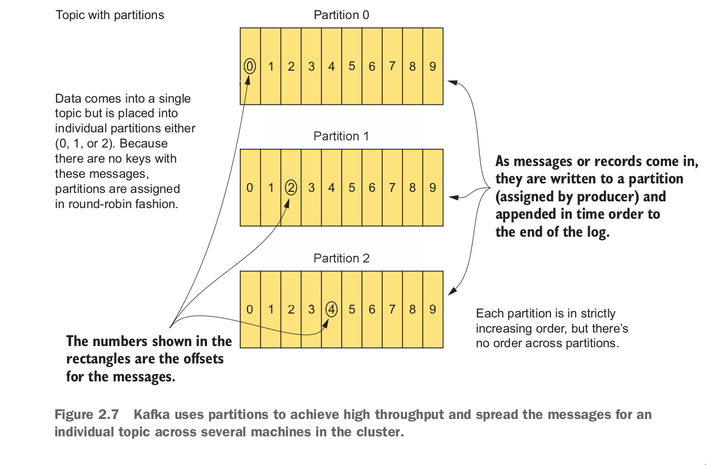
  

### Difference between Partition and Log?
At this time, you can come up with a question. Wait a minute, Aren't Log and Partition the same thing?
At first glance, they seem to look the same, but here are the difference: 
- Log: physical part of a topic, where a topic is stored on the disk.
- Partition: logical unit used to break down a topic into splits for redundancy and scalability.
You can see `Log` stored on disk. But with `Partition`, you can't. `Partition` is handled logically.


####  Partitions group data by key
When a message is sent to kafka, you can specify a `key` option for that message. 

If the key(key will be explained in the next section) isn't null. Kafka uses the following formula to calculate which partition the message will be sent to.

```
Producer -> message(key, value) -> Kafka
// Kafka choose a partition by using the formula
target_partition = HashCode.(key) % number of partitions
```
Records with the same key will always be sent to the same partition and in order.

### Important characteristics of Kafka

- Kafka stores and retrieves message from topic. Doesn't keep any state of producers or consumers

- Messages are written into Kafka in batches. A batch is just a collection of messages, all of which are being produced to the same topic and partition.

## Producers and Consumers

### Producer
`Producers` create new messages. In other publish/subscribe systems, these may be called publishers or writers.  A message will be produced to a specific topic.
 - The producer does not care what partition a specific message is written to and will balance messages over all partitions of a topic evenly
 - In some cases, the producer will direct messages to specific partitions using `message key`. Messages with a specified `message key` will be ensured to come in the right order in a partition.
  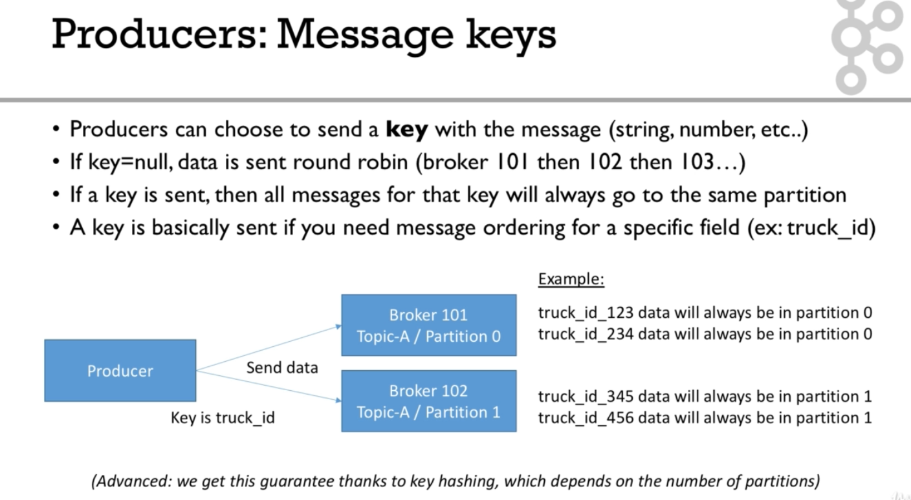

### Consumer

`Consumers` read messages. In other publish/subscribe systems, these may be called subscribers or readers.
- The consumer subscribes to one or more topics and reads the messages in the order in which they were produced.
- The consumer keeps track of which message it has already consumed by keeping track of the offset of messages.
  
The `offset` is a simple integer number that is used by Kafka to maintain the current position of a consumer.
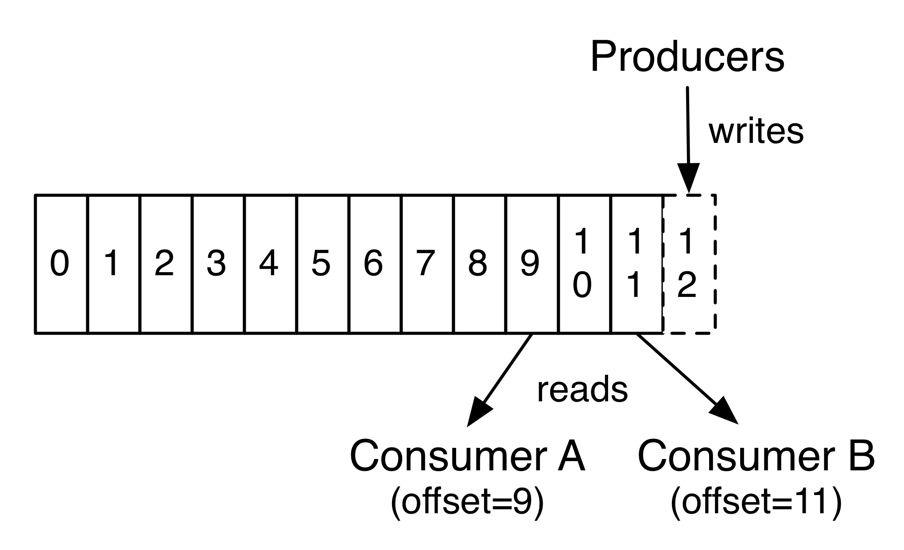


`Consumers` work as part of a `consumer group`, which is one or more consumers that work together to consume a topic. Group assures that each partition is only consumed by one member. If a single consumer fails, the remaning members of group will rebalance the partitions being consumed to take over the missing member.

#### Consumer group

Consumers groups used to read and process data in parallel.

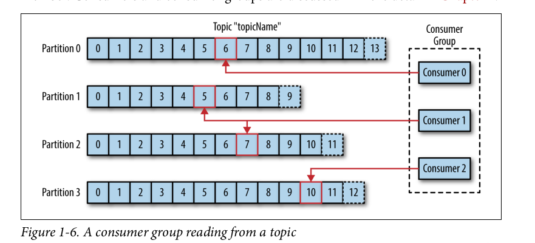


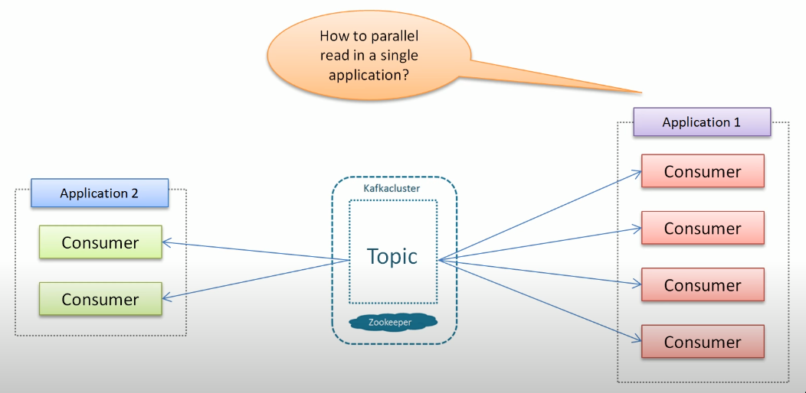

How consumers can read data in parallel without duplicate reads? Kafka provide a simple solution for this problem.
 - A partition can only be consumed by one consumer at a time. 
 - But a consumer can consume multiple partitions parallelly.

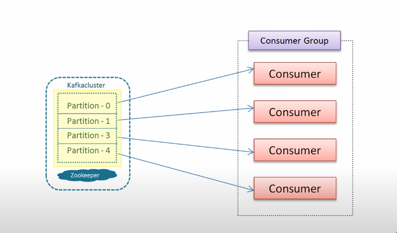

For example:
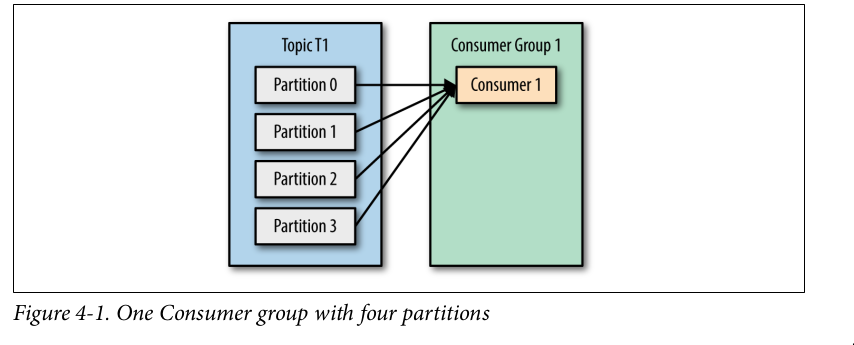

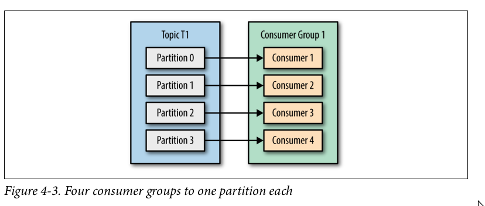
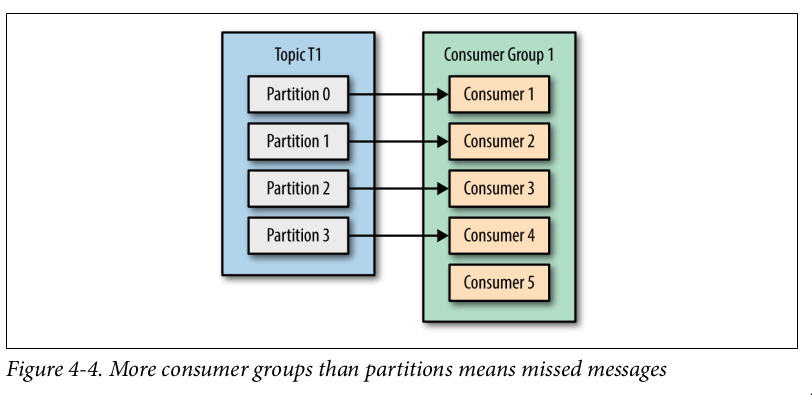

If the number of consumers in a group exceeds the number of partitions in a topic. Then there will be some idle consumer that get no messages at all
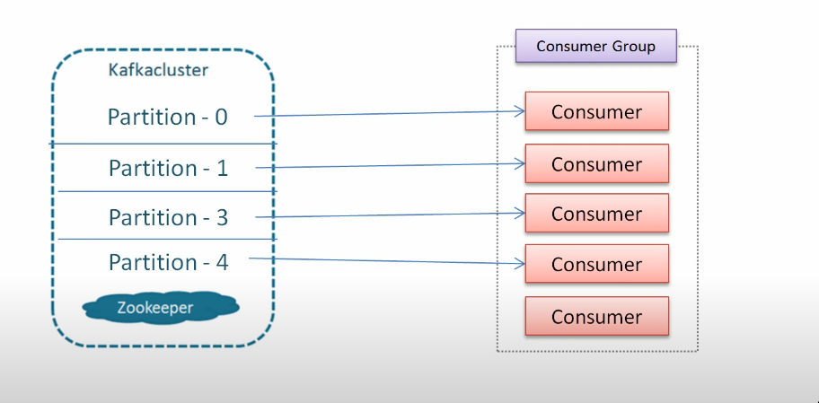

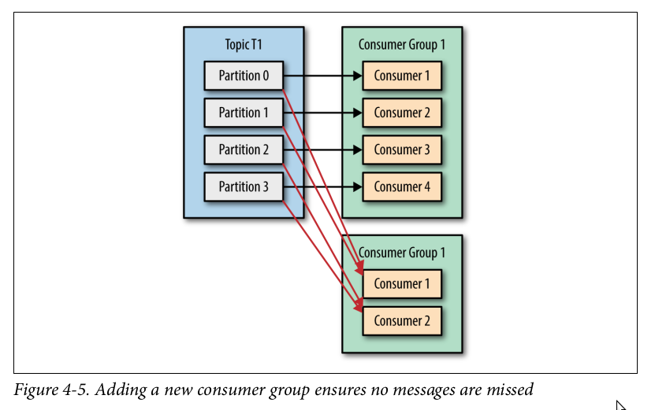

You can create a new consumer group for each application that needs all
the messages from one or more topics


#### Flow of sending a message
- Create a `ProducerRecord`, which must include the topic we want to send the record to and a value. Optionally, we can also specify a key and/or a partition.
- Then Serialized the key and value objects to `ByteArrays` so they can be sent over the network
- Data is sent to a `partitioner`. The partition check if ProducerRecord has a specifed `partition` option. If yes, it doesn't do anything an reply the `partition` we specify. If not, the partitioner will choose a `partition` for us.
- Once a `partition` is selected, the producer then add the record to a `batch` of records that will also be sent to the same topic and partition.
- When broker receives the messages, it sends back a response. 
  - If the messages were successfully writtent to Kafka, return a RecordMetaData object contains `<topic, partition, offset>`
  - If failed, the broker will return an error. The producer may retry sending the message a few more times before giving up and returning an error.

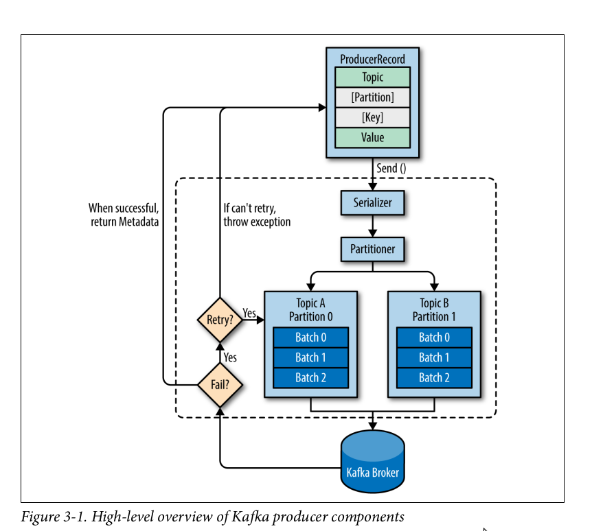


## Broker and Clusters

### Broker

A single Kafka server is called a broker. The broker receives messages from producers, assigns offsets to them and commits the messages to storage on disk.

Brokers are desigined to operate as part of a cluster.

### Cluster membership management with Zookeeper
Kafka uses Apache Zookeeper to maintain the list of brokers that are currently members of a cluster. ZooKeeper is a consistent file system for configuration information.

It acts as a centralized service and helps to keep track of the Kafka cluster nodes status, Kafka topics, and partitions. 
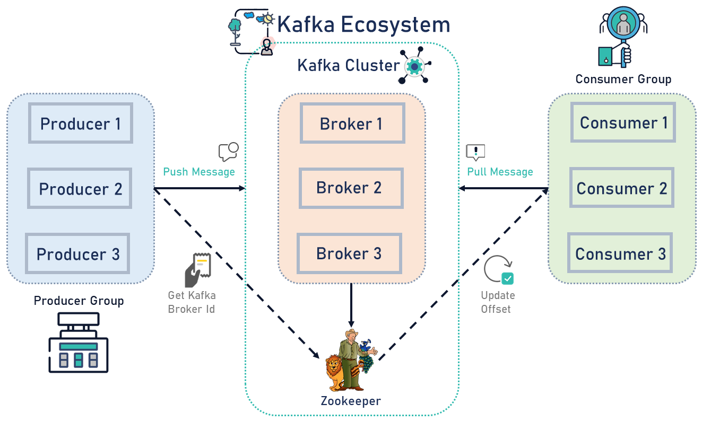


### Cluster controller
In a cluster, one broker will also function as the `cluster controller`

A cluster controller is one of the kafka brokers that in addition to the usual broker functionality:
- administrative operations: assigning partitions to brokers and monitoring for broker failures
- electing partition leaders(explained in the next section)
- Cluster only have one controller at a time
- The first broker that starts in the cluster becomes the controller.

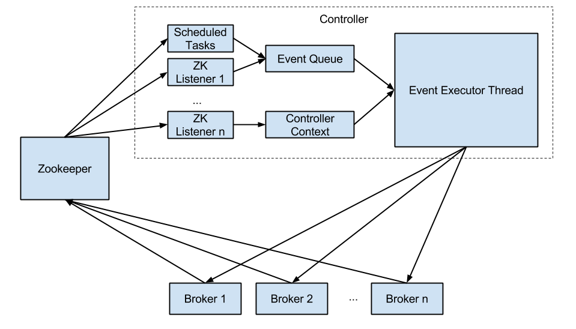

### Replica 

Replication is at the heart of Kafka's architecture. It guarantees availability and
durability when individual nodes inevitably fail.
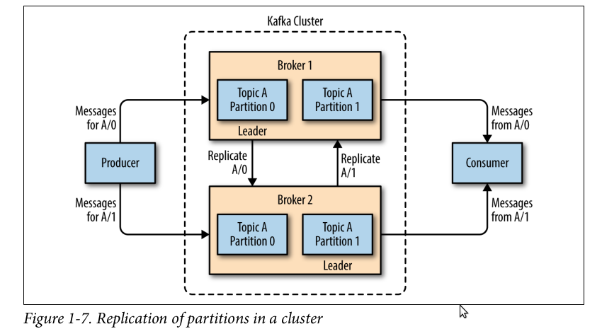

Each broker holds a number of partitions and each of these partitions can be either a leader or a replica for a topic

There are two types of replica:

#### Leader replica
- Each partition has a single replica designated as the leader.
- All produce and consume requests go through the leader, in order to guarantee consistency.
- Each partition also have a `prefered leader`, the replica that was the leader when the topic is originally created.

#### Follower replica
- All replicas for a partition that are not leaders are called followers
- Followers don't serve client requests
- Only replicate messages from the leader and stay up-to-date with the most recent message the leader has
- When a leader crashes, one of follower replica will be promoted to become the leader
- A Follower replica that catch up with the most recent messages of the leader are callled In-Sync replica
- Only in-sync replicas are eligible to be elected as partition leader in case the existing leader fail 

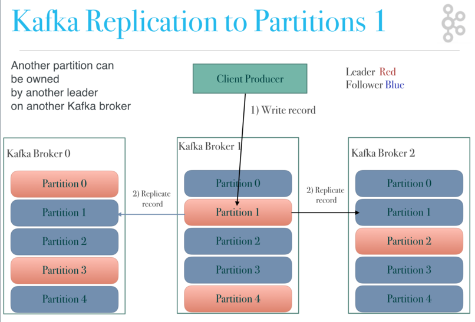

When `a controller` notices that a broker left the cluster. All the partitions that had a leader on that broker will need a new leader, so the controller  will choose a new leader for all of these partitions

## Configurations


### Hardware selection
#### Disk Throughput
- Faster disk writes will equal lower produce latency
- SSDs have drastically lower seek and access times and will provide the best performance

#### Disk capacity
- If the broker is expected to receive 1 TB of traffic each day, with 7 days of retention, then the broker will need a minimum of 7 TB of usable storage for log segment
#### Memory

Having more memory available to the system for page cache will improve the performance of consumer clients'

### Partitions count, replication factor
The two most important parameters when creating a topic: Patition and replication factor
They impact performance and durability of the system overall

#### Patitions
- Each partition can handle a throughput of a few MB/s
- More patitions implies:
  - Better parallelism, better throughput
  - Ability to run more consumers in a group to scale
  - Ability to leverage more brokers if you have a large cluster
  - BUT more elections to perform for Zookeeper
  - BUT more files opened on Kafka

Guidelines:
  - Patitions per topic = MILLION DOLAR QUESTION
    - Small cluster(<6 brokers>): #partitions per topic =  2 x number of brokers
    - Big cluster(>12 brokers): 1 x # of brokers

#### Replication: should be at least 2, usually 3, maximum 4
The higher the replication factor(N):
  - Better resilience of your system(N-1 brokers can fail)
  - But more replication (higher latency if acks=all)

### Configure topic
Why should I care about topic config?
- Brokers have defaults for all the topic configuration paramters
- These parameters impact performance and topic behavior

#### Retention and clean up policies(Compaction)
Retention is the durable storage of messages for some period of time. For example, a tracking topic might be retained for several days, whereas application metrics might be retained for only a few hours.

Retention policy:
- Delete: delete events older than retention time
- Compact: Only stores the most recent value for each key in the topic. Only works on topics for which applications produce events that contain both a key and a value

- `log.cleanup.policy=delete`: 
  - Delete based on age of data(default is a week)
  - Deleted based on max size of log(default is -1 == inifinite)

- `log.cleanup.policy=compact`:
  -  Delete based on keys of your message
  -  Will delete old duplicate keys after the active segment is commited

- `log.retention.hours`: 
   - number of hours to keep data fro
   - Higher number means more disk space
   - Lower number means that less data is retained(if your consumers are down for too long, they can miss data)
  
- `log.retention.bytes`:
  - Max side in bytes for each partition

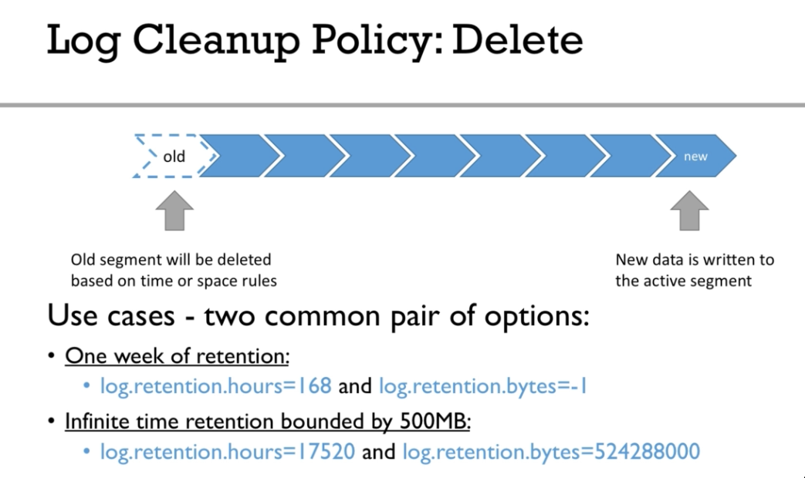

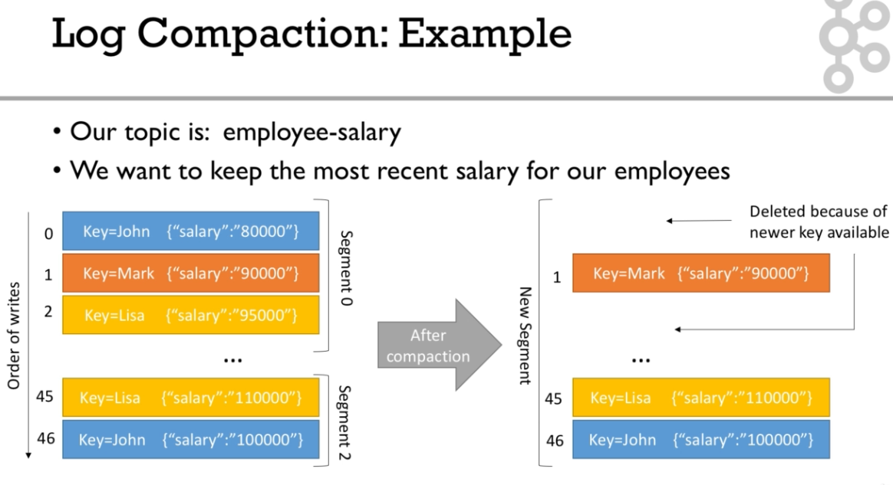

- Delete records can still be seen by consumers for a period of `delete.retention.ms`

  
#### Paritions and Segments
- Partitions are made of ...segments(files)
  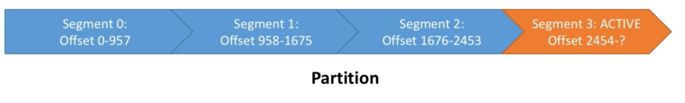
- Active segment means the segment are still being written to
- `log.segment.bytes`: the max size of a single segment in bytes
- `log.segment.ms`: the time Kafka will wait before comming the segment if not full

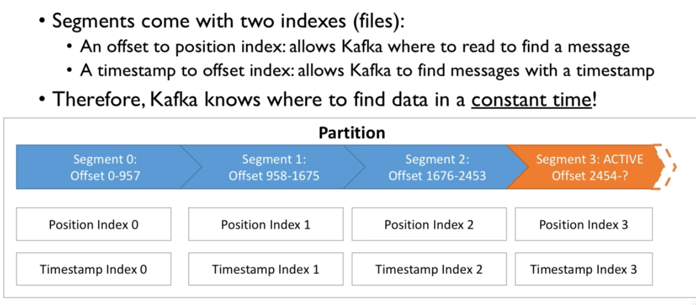


### Configure producer

#### Kafka broker discovery
- Every Kafka broker is also called a "boostrap server"
- You only need to connect to one broker and you will be connected to the entire cluster
- Each broker knows about all brokers, topics and patitions

#### Options for producer configuration
- **bootstrap.servers**: List of host:port of brokers that the producer will use to establish initial connection to the kafka cluster. It is recommended to include at least two, incase one goes down, the producer will still be able to connect to the cluster

- **acks**: Controls how many partition replicas must receive the record before the producer can consider write successful.
 
  - acks = 0: the producer will not wait for a reply from the broker before assuming the message was sent successfully. The message may be lost but it can send messaes as fast as the network will support, so this setting can be used to achieve very high throughput
  - acks=1: With a setting of 1, the producer will consider the write successful when the leader receives the record. The leader replica will know to immediately respond the moment it receives the record and not wait any longer.

   - acks=all: the producer will consider the write successful when all of the in-sync replicas receive the record. This is achieved by the leader broker being smart as to when it responds to the request — it’ll send back a response once all the in-sync replicas receive the record themselves.
   - Acks=all must be used in conjunction with `min.insync.replicas`
   - In-sync replicas: An in-sync replica (ISR) is a replica that has the latest data for a given partition. A leader is always an in-sync replica. A follower is an in-sync replica only if it has fully caught up to the partition it’s following.
    - Minimum In-Sync Replica: `min.insync.replicas` is a config on the broker that denotes the minimum number of in-sync replicas required to exist for a broker to allow acks=all requests. That means if you use `replication.factor=3, min.insync=2, acks=all`, you can only tolerate 1 broker going down, otherwise the producer will receive an exception on send.
  - `max.in.flight.request.per.connection`: setting while controls how many produce requests can be made in parallel. Set it to 1 if you need to ensure ordering(may impact throughput)
  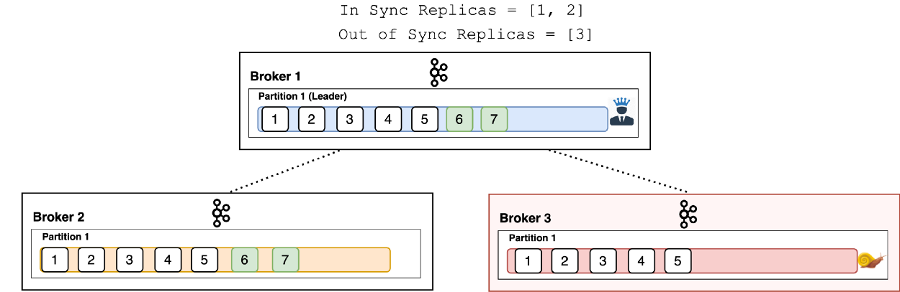

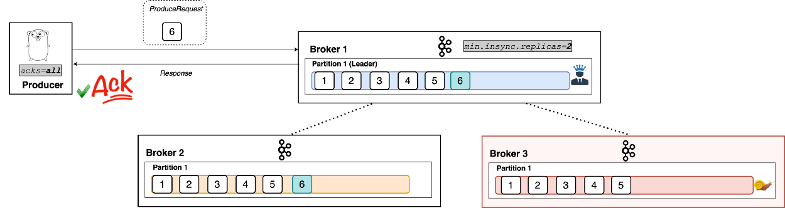
min.insync.replicas=X allows acks=all requests to continue to work when at least x replicas of the partition are in sync

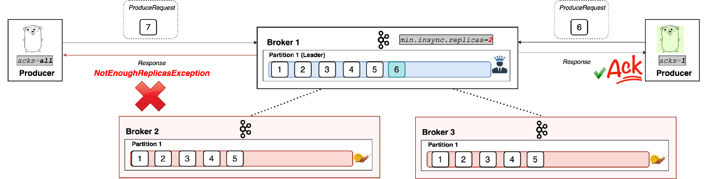
 if we go below that value of in-sync replicas, the producer will start receiving exceptions.
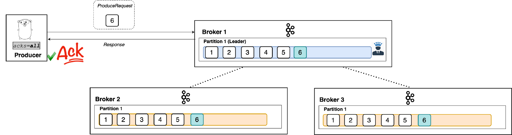
https://medium.com/better-programming/kafka-acks-explained-c0515b3b707e#:~:text='acks%3D1',producer%20waits%20for%20a%20response

`acks` setting is a good way to configure your prefered trade-off between durability guarantees and performance

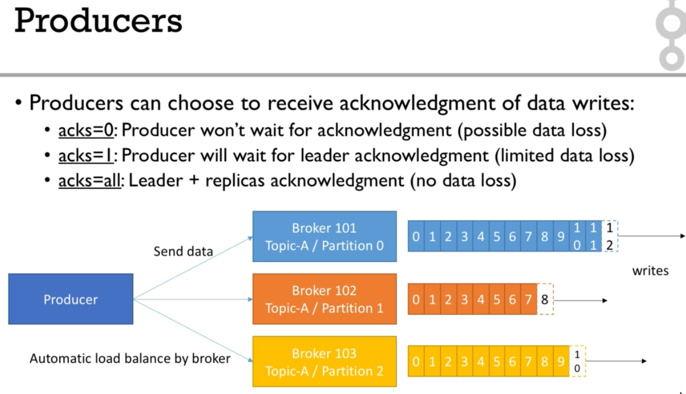


- **buffer memory**: this sets the amount of memory the producer will use to buffer messages waiting to be sent to brokers.
- **compression.type**: By default, messages are sent uncompressed. We can ues `gzip`, `lz4`. Enabling compression reduce network utilization and storage
- **retries**: How many times the producer will retry sending the message
- **batch.size**: The producer will batch them together. When the batch is full, all the messages in the batch will be sent.
- **client.id**: Use by the brokers to identify messages sent from the client


#### Message compression for high-throughpput producer
- Compression is more effective the bigger the batch of message being sent to kafka is !
- `compression.type` can be `none`, `gzip`, `lz4`, `snappy`
- Much smaller producer request size
- Faster to transfer data over the network => less latency
- Better throughput
- Better disk utilization in Kafka(stored messages on disk are smaller)
- BUT Producers must commit some CPU cycles to compression and decompression
- Should use `snappy` or `lz4`, `gzip` is slow
- Always use compression in production and especially if you have high throughput
- Consinder tweaking `linger.ms` and `batch.size` to have bigger batches, and therefore more compression and higher throughput 

#### Producer batching
- By default, Kafka tries to send records as soon as possible:
  - It will have up to 5 requests in flight meanning 5 messages sent at the same time
  - If more messages have to be sent while others are in flight, Kafka is smart and will start batching them while they wait to send them all at once
- **linger.ms**: Number of milliseconds a producer is willing to wait before sending a batch out.
  - `linger.ms=5` we increase the chances of messages being sent together in a batch.
  - At the expense of introducing a small delay, we can increase throughput, compression and efficiency for our producer

- **batch.size**: Maximum number of bytes that will be included in a batch. The default is 16KB
  - Increase batch size to `32KB` or `64KB` can help increasing throughput
  - A batch is allocated per partition, make sure don't set it to a number that's too high

If the producer produces faster than the broker can take, the records will be buffered in memory
- `buffer.memory=33554432(32MB)`
- If the buffer is full(all 32 MB), `.send()` method wil start to block
- `max.block.ms=60000`, the time the `.send()` will block until throwing an exception.

#### Idempotent producer
The producer can introduce duplicate messages in Kafka due to network errors

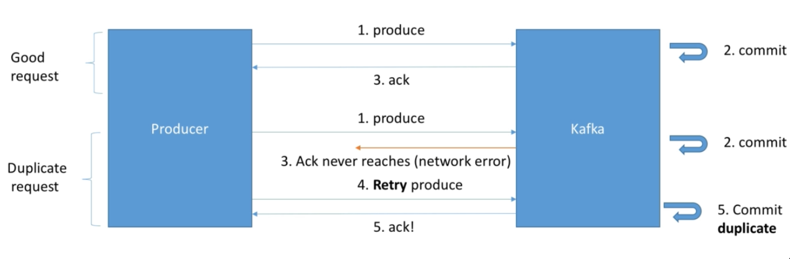

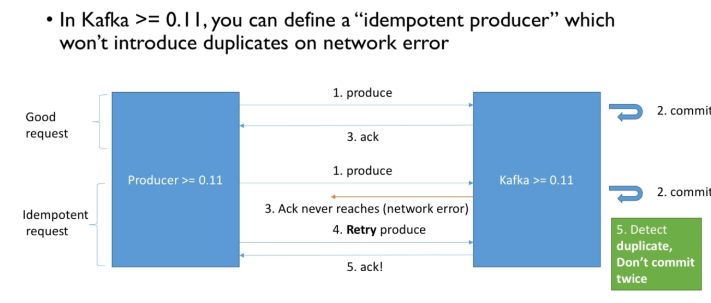 

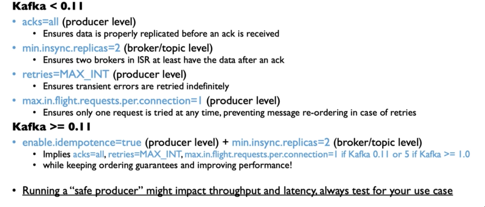
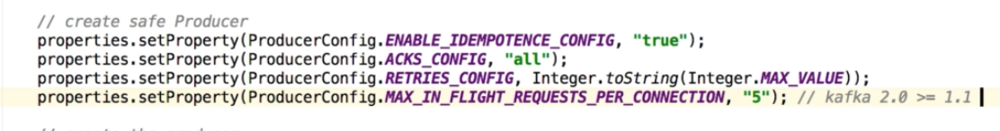


### Configure consumer
#### How kafka handle consumers exit/enter groups?

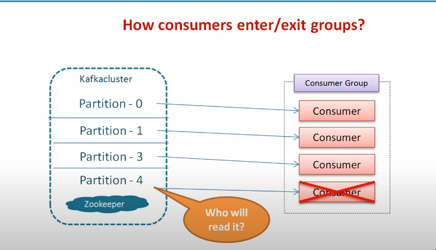
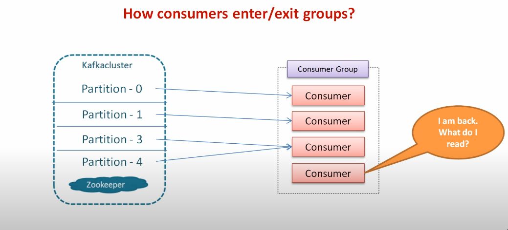

That's the job of a group coordinator 


One of the kafka brokers get elected as a group coordinator. When a consumer want to join a group, it send a request to the group coordinator

The first consumer participating in a group is called a group leader.

During the `rebalance` activity, none of the consumers are allowed to read any messages.

`rebalance`:  When a new consumer joins a consumer group the set of consumers attempt to "rebalance" the load to assign partitions to each consumer.

#### Controlling consumer liveness?

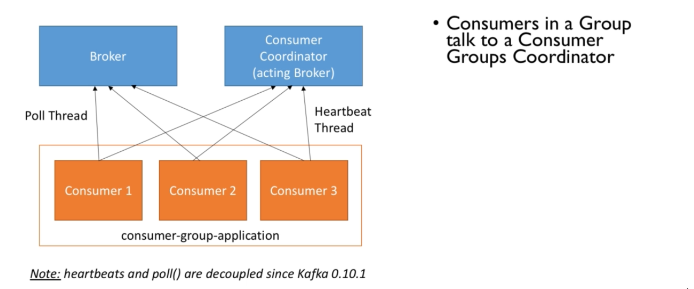

- **session.timeout.ms**: (default 10 seconds)
  - If no heartbeat is sent during that period, the consumer is considered dead
  - Set even lower to faster consumer rebalances
  
- **heartbeat.interval.ms**: (default 3 seconds)

#### Consumer offset
- Kafka stores the offset at which a consumer group has been reading
- The offsets are commited in a Kafka topic named **__consumer__offsets**
- If a consumer dies, it will be able to read back from where it left off thanks to the commited consumer offset

#### Consumer offset reset behaviours

- Consumer can be down so it need to know where to start to read the log
- `auto.offset.reset=latest`: will read the end of the log
- `auto.offset.reset=earliest`: will read from the start of the log
- `auto.offset.reset=none`: Wil throw exception if no offset is found
- `offset.retention.minutes`: Consumer offsets can be lost if a consumer hasn't read new data in 7 days

#### Delivery semantics for consumers
- At most once: offsets are commited as soons as the message is received 
  - If the processing goes wrong, the message will be lost(it won't be read again)
  - Commits first then read
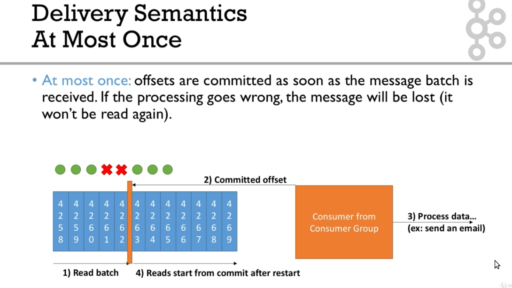

  
- At least once(usually preferred):
  - Offsets are commited after the message is processed
  - If the processing goes wrong, the message will be read again
  - This can result in duplicate processing of messages. Make sure your processing is idempotent
  - Read then commits
 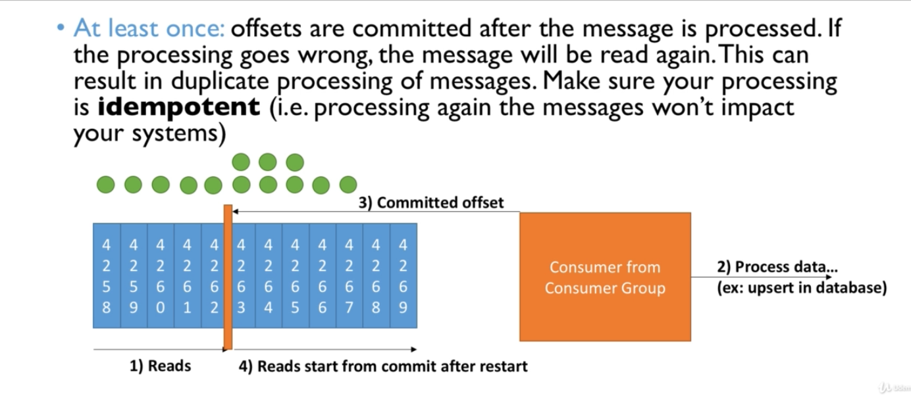  

- Exactly once: only from kafka to kafka

#### Offset management
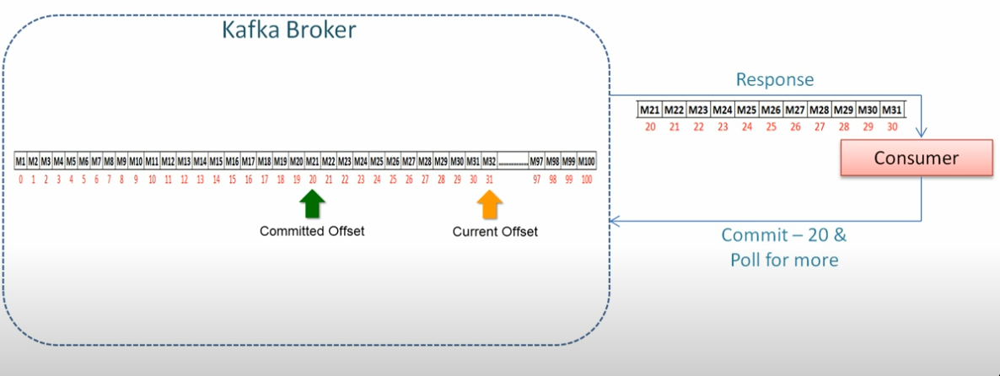
In the event of rebalancing, when a consumer is a assigned the same partition, it should ask a question where to start. What is already processed by the previous owner? That's where Commited offset comes into play

- Current offset: Delivered records
- Commited offset: Processed records

How to commit?
- AutoCommit:
  - `enable.auto.commit`
  - `auto.commit.interval.ms`
Can't avoid processing a record multiple times. If rebalancing happens before producer hasn't automatically commited
- Manual Commit:
  - Commit sync: block
  - Commit async: Commit async will not retry
  
#### Consumer offset commits strategies
2 strategies
- (easy) enable.auto.commit = true & synchronous processing of batches
If you don't use synchronous processing, you will be in "at-most-once" behavior because offsets will be commited before your data is processed. Quite risky for beginners
- (medium) enable.auto.commit = false & manual commit of offsets
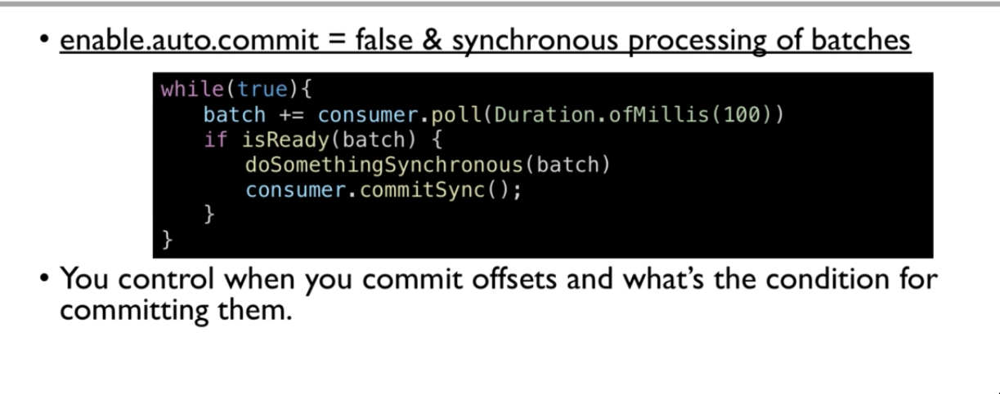

#### Schema registry
- Kafka takes bytes as an input and publishes them 
- No data verification
What if the producer sends bad data? The consumers break. So
- We need data to be self describable
- Need to be able to evolve data without breaking downstream consumers

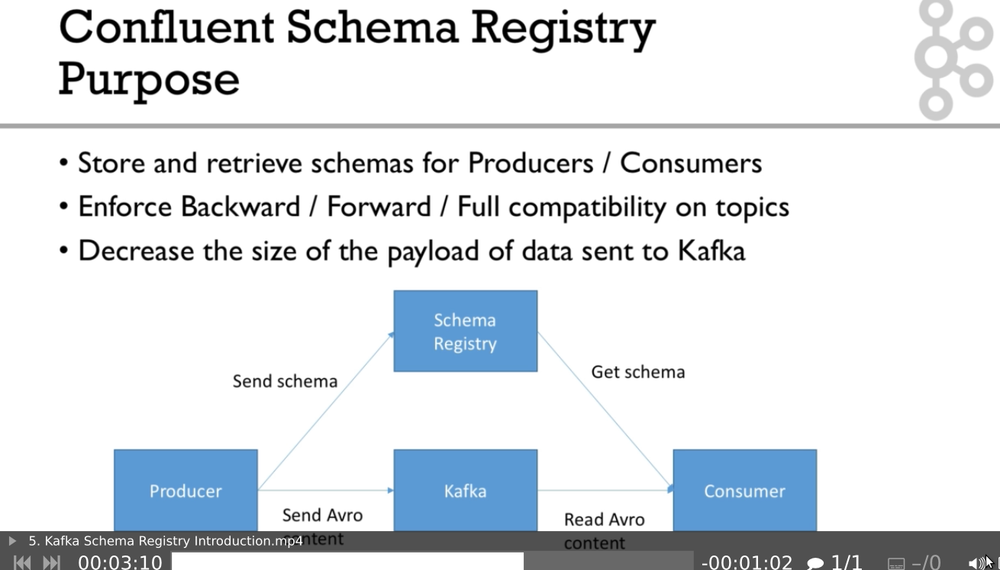


## Case study
### Video analytics - MovieFlix
- Make sure the user can resume the video where they left it off
- Build a user profile in real time
- Recommend the next show to the user in real time
- Store all the data in analytics store

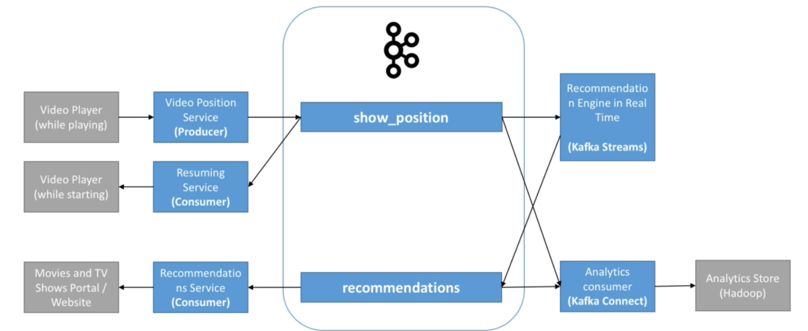

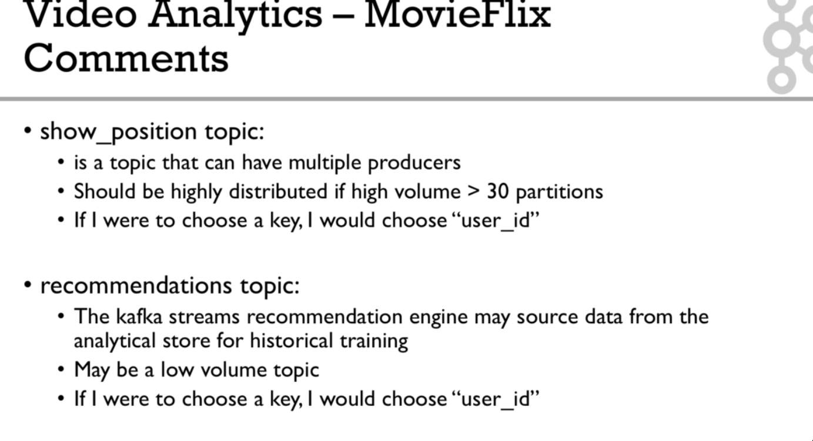

### GetTaxi
Gettaxis is a company that allows people to match with taxi drivers on deman, right-away. The business wants the following capabilities:
- The user should match with a close by driver
- The pricing should "surge" if the number of drivers are low or the number of users is high
- All the position data before and during the ride should be stored in an analytics store so that the cost can be computed accurately

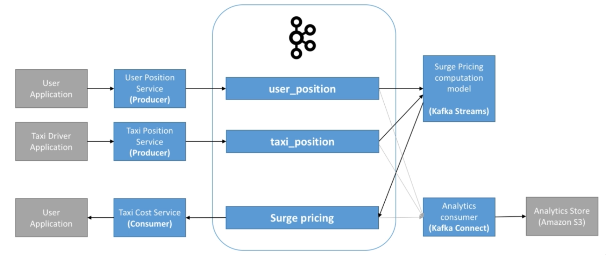

### Campaign compare

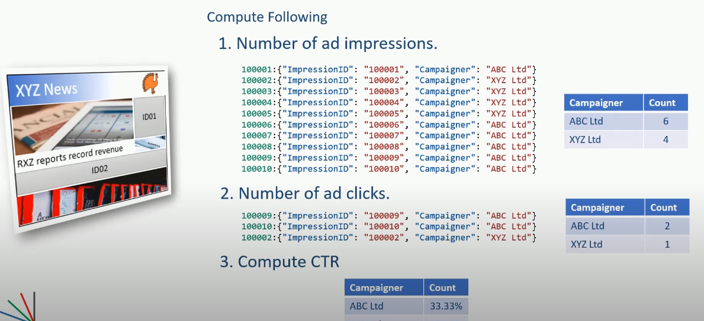

### Mysocial media
- Users should be able to post, like and comment
- Users should see the toal number of likes and comments per post in real time
- High volume of data is expected on the first day of launch
- Users should be able to see "trending" posts


### Finance application - MyBank  
- MyBank is a company that allows real-time banking for its users. It wants to deploy a brand new capability to alert users in case of large transactions
- The transactions data already exists in a database
- Thresholds can be defined by the users

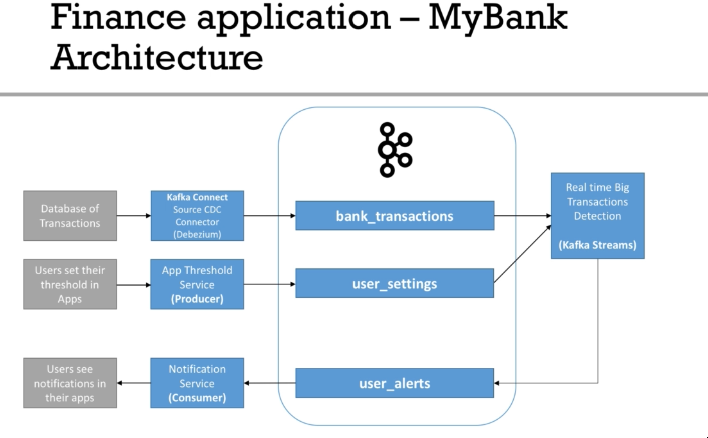

### Big data ingestion
- It is common to have "generic" connectors or solutions to offload data from Kafka to HDFS
- It is also very common to have Kafka serve a "speed layer" for real time applications

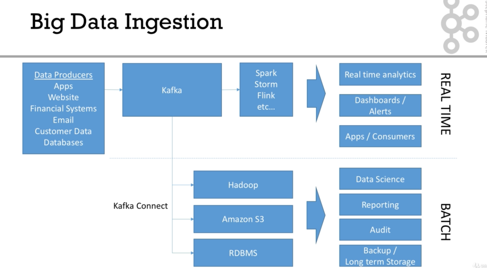


## Kafka internal

### Request processing
Kafka has a binary protocol that specifies the format of the requests and how brokers respond to them

Every broker has:
- **Acceptor**: A thread that handling creating connection
- **Processor**: Handling request threads are responsible for taking requests from client connections, placing them in a request queue, picking up response from response queue and send them back to clients.There are two types of request
  - Produce requests
  - Fetch requests

Client uses another request type called a `metadata` request to get information about where to send the request. Which is a list of topics the client is interested in. The Server respond specifies which partitions exist in the topics, the
replicas for each partition, and which replica is the leader

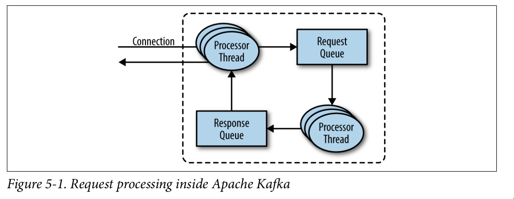
```
Client -> meta data request(list of interested topics) -> Server
Leader -> Respond { 
    partitions of the topic,
    the replicas for each patition,
    which replica is the leader
  } -> Server
```

Client usually cache this information and priodically refresh this information.(controlled by 
`data.max.age.ms` configuration parameter)

if a new broker was added or some replicas were moved to a new broker. A client will receives the error `Not a Leader` and then it will refresh the `metadata` before try sending the request again

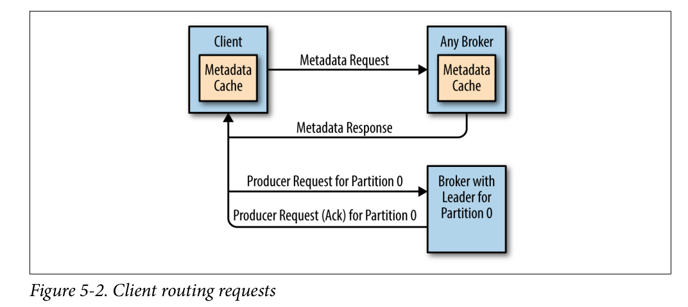

### Physical storage
#### Partition Allocation

Suppose you have 6 brokers and you decide to create a topic with 10 partitions and a replication factor of 3. Kafka now has 30 partition replicas to allocate to 6
brokers.
- 5 replicas per broker
- for each partition, each replica is on a different broker.
- If the brokers have rack information, then assign the replicas for each partition to different racks if possible


#### File Management
Kafka administrator configures a retention period for each topic:
  - The amount of time to store messages before deleting them
  - how much data to store before older messages are purged

**partition** are splitted into segments. Each segment contains either 1GB or a week of data
**segment** we are currently writing to is called active **segment**. Active segment is never deleted

## References

[[Book] Kafka definitive guide ](https://www.amazon.com/Kafka-Definitive-Real-Time-Stream-Processing/dp/1491936169)

[[Book] Kafka Streams in Action ](https://www.amazon.com/Kafka-Streams-Action-Real-time-microservices/dp/1617294470)

[[Stackoverflow] Why kafka is fast?](https://rmoff.net/2020/07/08/learning-golang-some-rough-notes-s02e00-kafka-and-go/)

[[Udemy course] Apache kafka](https://www.udemy.com/course/apache-kafka/)

[[Youtube] Apache kafka tutorials - Learning Journal](https://www.youtube.com/playlist?list=PLkz1SCf5iB4enAR00Z46JwY9GGkaS2NON)


